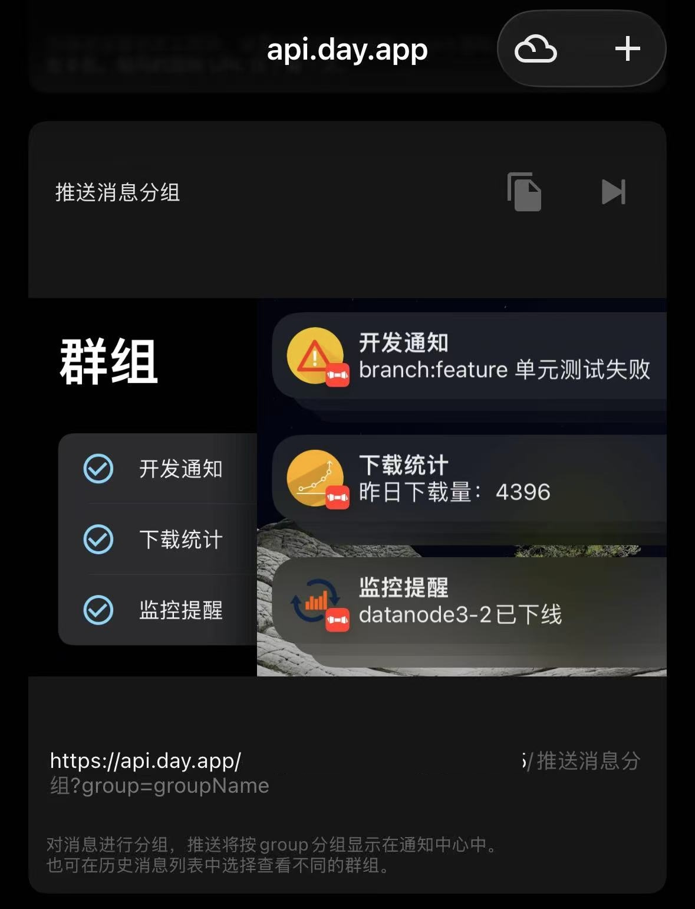

# Bark Webpage Notifier

<p align="center">
  <a href="#中文"><strong>中文</strong></a>
  ·
  <a href="#english"><strong>English</strong></a>
</p>

## 中文

把【支持的网页列表】新消息标题，分组通过 Bark 推送到 iOS 端。由于此推送是通过 GitHub Actions 云端定时轮询，约 5 分钟一次，所以仅适用于时效性要求不高的消息。

## 前置准备

1. 注册一个 GitHub 账号。

2. 在 iOS 端下载 Bark App，找到“推送消息分组”的 URL。后续配置时，需要先把 URL 末尾的 `groupName` 改成对应的组名，然后再粘贴完整 URL。

   

3. 在终端检查并准备这些命令：

```bash
git --version
curl --version
python3 --version
gh --version
```

4. 如果缺少 GitHub CLI，先安装它：

```bash
brew install gh
```

5. 登录 GitHub：

```bash
gh auth login
```

6. 如果你的电脑没有 `brew`，先安装 Homebrew：

```bash
/bin/bash -c "$(curl -fsSL https://raw.githubusercontent.com/Homebrew/install/HEAD/install.sh)"
```

## 一键开始

在终端运行：

```bash
curl -fsSL https://raw.githubusercontent.com/bella07021/bark-webpage-notifier/main/scripts/setup_cloud.sh | bash
```

脚本会带你完成完整流程：

- 选择中文或英文
- 创建或更新一个 GitHub 仓库
- 添加一个或多个推送组
- 为每个推送组选择信息来源、填写关键词、Bark 分组名和 Bark URL
- 确认后把 Bark key 保存到 GitHub Secrets
- 发送一条 `test success` 测试推送
- 推送 GitHub Actions workflow
- 启动第一次 workflow

第一次 workflow 只记录当前旧消息，不会推送历史标题；之后默认每 5 分钟检查一次，只推送新增标题。

以后想添加第二个、第三个推送组，继续运行同一条一键命令即可。脚本会读取已有配置，追加新的推送组并更新 workflow。

<details>
<summary><strong>常见问题</strong></summary>

### 安装 skill 后还要一直打开 Codex 吗？

不用。真正负责定时轮询和推送的是 GitHub Actions。Codex skill 只是可选辅助能力，用来让 Codex 以后帮你添加网页、修改关键词或调整通知格式。

### 通知里会有什么？

默认只推标题，并使用 Bark 分组：

```json
{
  "title": "币安合约",
  "body": "币安合约将上线某某代币",
  "group": "币安合约"
}
```

默认不带链接、不带副标题、不带摘要。

### 后面想再加一个推送组怎么办？

重新运行一键开始里的命令。脚本会显示已有推送组，然后问你是否继续添加新的推送组。

### 支持哪些网页？

内置来源可以直接使用：

| source | 网站 | 适合关键词 |
|---|---|---|
| `chaincatcher-search` | ChainCatcher 搜索页 | 中文关键词 |
| `odaily-newsflash` | Odaily 星球日报快讯 | 中文关键词 |
| `panews-rss` | PANews RSS | 中文关键词 |
| `coindesk-rss` | CoinDesk RSS | 英文关键词 |

其他网页适合稳定的搜索页、资讯列表、RSS、公开 JSON API、SSR HTML、页面内嵌 JSON。<br>
如果网页有验证码、人机验证或 Cloudflare challenge，长期云端轮询通常不稳定，最好改找公开 API、RSS 或备用来源。

</details>

<details>
<summary><strong>可选：安装 Codex Skill</strong></summary>

如果你想让 Codex 以后帮你维护监控规则，可以安装这个 skill：

```bash
curl -fsSL https://raw.githubusercontent.com/bella07021/bark-webpage-notifier/main/scripts/install_skill.sh | bash
```

然后重开 Codex，就可以说：

```text
用 bark-webpage-notifier 帮我监控这个网页，并推送到 Bark
```

手动安装方式：

```bash
mkdir -p ~/.codex/skills
cp -R bark-webpage-notifier ~/.codex/skills/
```

</details>

<details>
<summary><strong>高级：已有仓库时配置 GitHub Actions</strong></summary>

如果你已经 clone 或 fork 了这个仓库，可以在仓库目录运行：

```bash
scripts/setup_github_actions.sh
```

手动配置步骤：

1. 在 GitHub 仓库添加 Secrets：

```text
Settings -> Secrets and variables -> Actions -> New repository secret
```

推送组配置保存在仓库里的 `bark_topics.json`，Bark key 保存在 GitHub Secrets。Secret 名称由脚本自动生成，例如：

```text
BARK_KEY_TOPIC_1
BARK_KEY_TOPIC_2
```

2. 复制 workflow：

```bash
mkdir -p .github/workflows
cp examples/github-actions/chaincatcher-bark.yml .github/workflows/bark-web-watch.yml
```

3. 推送到 GitHub 后，打开：

```text
Actions -> Bark Webpage Watch -> Run workflow
```

GitHub Actions 的 `schedule` 不是秒级实时任务，可能有几分钟延迟，这是正常的。

</details>

<details>
<summary><strong>高级：本地运行和调试</strong></summary>

本地运行只适合调试或自己电脑定时任务。普通用户推荐使用上面的一键云端部署。

在运行监控脚本的工作目录里创建 `.env`：

```bash
BARK_KEY=你的默认BarkKey
```

多分组可以用主题专属变量：

```bash
BARK_KEY_BINANCE_ALPHA=你的BarkKey
BARK_GROUP_BINANCE_ALPHA=币安 alpha
SOURCE_BINANCE_ALPHA=chaincatcher-search
KEYWORDS_BINANCE_ALPHA=币安 alpha

BARK_KEY_BINANCE_CONTRACT=你的BarkKey
BARK_GROUP_BINANCE_CONTRACT=币安合约
SOURCE_BINANCE_CONTRACT=odaily-newsflash
KEYWORDS_BINANCE_CONTRACT=币安合约将上线
```

可用的内置 `SOURCE`：`chaincatcher-search`、`odaily-newsflash`、`panews-rss`、`coindesk-rss`。

发送测试推送：

```bash
python3 ~/.codex/skills/bark-webpage-notifier/scripts/bark_web_watch.py \
  --topic binance-contract \
  --test-title "币安合约将上线测试消息"
```

初始化当前搜索结果为“已见过”：

```bash
python3 ~/.codex/skills/bark-webpage-notifier/scripts/bark_web_watch.py \
  --topic binance-contract \
  --init-seen
```

单次检查并推送新增标题：

```bash
python3 ~/.codex/skills/bark-webpage-notifier/scripts/bark_web_watch.py \
  --topic binance-contract \
  --once
```

</details>

---

## English

Push new titles from supported webpages to iOS through grouped Bark notifications. Polling runs in GitHub Actions about every 5 minutes, so this is best for messages that do not require second-level delivery.

## Prerequisites

1. Create a GitHub account.

2. Install the Bark app on iOS and find the "grouped notification" URL. Before setup, replace the trailing `groupName` with your group name, then paste the full URL when prompted.

   

3. Check these commands in Terminal:

```bash
git --version
curl --version
python3 --version
gh --version
```

4. If GitHub CLI is missing, install it first:

```bash
brew install gh
```

5. Log in to GitHub:

```bash
gh auth login
```

6. If your Mac does not have `brew`, install Homebrew first:

```bash
/bin/bash -c "$(curl -fsSL https://raw.githubusercontent.com/Homebrew/install/HEAD/install.sh)"
```

## Quick Start

Run this in Terminal:

```bash
curl -fsSL https://raw.githubusercontent.com/bella07021/bark-webpage-notifier/main/scripts/setup_cloud.sh | bash
```

The script guides you through the full setup:

- choose Chinese or English
- create or update a GitHub repository
- add one or more notification groups
- choose a source, keywords, Bark group, and Bark URL for each group
- save Bark keys as GitHub Secrets after confirmation
- send a `test success` push
- push the GitHub Actions workflow
- start the first workflow run

The first workflow run records current old titles without pushing them. Later runs check every 5 minutes by default and push only new titles.

Run the same one-command setup again later to add another notification group. The script reads the existing config, appends the new group, and updates the workflow.

<details>
<summary><strong>FAQ</strong></summary>

### Do I need to keep Codex open after installing the skill?

No. GitHub Actions does the scheduled cloud polling and pushing. The optional Codex skill only helps Codex add pages, change keywords, or adjust notification behavior later.

### What does the notification contain?

By default, it sends only the title and Bark group:

```json
{
  "title": "币安合约",
  "body": "币安合约将上线某某代币",
  "group": "币安合约"
}
```

No URL, subtitle, or summary is included by default.

### How do I add another notification group later?

Run the Quick Start command again. The script shows existing groups and asks whether you want to add a new one.

### What pages are supported?

Built-in sources can be used directly:

| source | Site | Good for |
|---|---|---|
| `chaincatcher-search` | ChainCatcher search | Chinese keywords |
| `odaily-newsflash` | Odaily newsflash | Chinese keywords |
| `panews-rss` | PANews RSS | Chinese keywords |
| `coindesk-rss` | CoinDesk RSS | English keywords |

Other pages work best when they are stable search pages, news lists, RSS feeds, public JSON APIs, SSR HTML, or embedded JSON.<br>
Pages protected by captcha, human verification, or Cloudflare challenge are usually unreliable for long-running cloud polling. Prefer a public API, RSS feed, or alternate source.

</details>

<details>
<summary><strong>Optional: Install The Codex Skill</strong></summary>

Install the skill if you want Codex to help maintain monitor rules later:

```bash
curl -fsSL https://raw.githubusercontent.com/bella07021/bark-webpage-notifier/main/scripts/install_skill.sh | bash
```

Restart Codex, then ask:

```text
Use bark-webpage-notifier to monitor this page and push new titles to Bark.
```

Manual install:

```bash
mkdir -p ~/.codex/skills
cp -R bark-webpage-notifier ~/.codex/skills/
```

</details>

<details>
<summary><strong>Advanced: Configure GitHub Actions In An Existing Repo</strong></summary>

If you already cloned or forked this repository, run this from the repository directory:

```bash
scripts/setup_github_actions.sh
```

Manual setup:

1. Add repository Secrets:

```text
Settings -> Secrets and variables -> Actions -> New repository secret
```

Notification groups are stored in `bark_topics.json`, while Bark keys are stored as GitHub Secrets. Secret names are generated by the script, for example:

```text
BARK_KEY_TOPIC_1
BARK_KEY_TOPIC_2
```

2. Copy the workflow:

```bash
mkdir -p .github/workflows
cp examples/github-actions/chaincatcher-bark.yml .github/workflows/bark-web-watch.yml
```

3. After pushing to GitHub, open:

```text
Actions -> Bark Webpage Watch -> Run workflow
```

GitHub Actions schedules are not real-time; delays of a few minutes are normal.

</details>

<details>
<summary><strong>Advanced: Local Run And Debugging</strong></summary>

Local runs are mainly for debugging or local schedulers. Most users should use the one-command cloud setup above.

Create `.env` in the workspace where you run the monitor:

```bash
BARK_KEY=your_default_bark_key
```

For multiple notification groups, use topic-specific variables:

```bash
BARK_KEY_BINANCE_ALPHA=your_bark_key
BARK_GROUP_BINANCE_ALPHA=币安 alpha
SOURCE_BINANCE_ALPHA=chaincatcher-search
KEYWORDS_BINANCE_ALPHA=币安 alpha

BARK_KEY_BINANCE_CONTRACT=your_bark_key
BARK_GROUP_BINANCE_CONTRACT=币安合约
SOURCE_BINANCE_CONTRACT=odaily-newsflash
KEYWORDS_BINANCE_CONTRACT=币安合约将上线
```

Available built-in `SOURCE` values: `chaincatcher-search`, `odaily-newsflash`, `panews-rss`, `coindesk-rss`.

Send a test push:

```bash
python3 ~/.codex/skills/bark-webpage-notifier/scripts/bark_web_watch.py \
  --topic binance-contract \
  --test-title "币安合约将上线测试消息"
```

Initialize current search results as already seen:

```bash
python3 ~/.codex/skills/bark-webpage-notifier/scripts/bark_web_watch.py \
  --topic binance-contract \
  --init-seen
```

Push new titles once:

```bash
python3 ~/.codex/skills/bark-webpage-notifier/scripts/bark_web_watch.py \
  --topic binance-contract \
  --once
```

</details>
